<Warn>
  Esse artigo foi feito no intuito de servir como fixação dos conteúdos que
  estou estudando no momento, ministrado pelo professor **Gabriel Ribeiro
  Diniz** para as aulas de **Banco de Dados** no curso de [**Gestão de TI -
  FAPAM**](https://www.fapam.edu.br/graduacao/project/gestao-de-t-i/).
</Warn>

<Tip>
  Parte 2 das aulas de Entidade-Relacionamento, continue apenas se já tiver lido
  a [**Parte 1**](/blog/post/mer---modelo-de-entidade-relacionamento-1).
</Tip>

# Generalização e Especialização

Generalização e Especialização são técnicas de modelagem que permitem representar um conjunto de entidades de forma mais abstrata. Ocorre herança de atributos entre as entidades, isto é, as entidades de nível inferior herdam todos os atributos e relacionamentos da entidade a qual estão ligadas.

**SÍMBOLO:** _Um **triângulo** de "cabeça para baixo"_

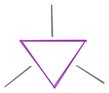
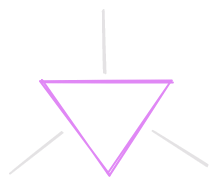

<Tip>
  Generalização e especialização são abstrações inversas e são representadas no
  esquema ER da mesma forma (mésmo símbolo)
</Tip>

## Especialização

Usada quando um conjunto de entidades possui subgrupos com características próprias.

Especificação de subgrupos dentro de um conjunto de entidades que são distintas, isto é, possuem casacterísticas específicas em um vez que possuem atributos ou relacionamentos que não se aplica ao conjunto entidade de nível superior.

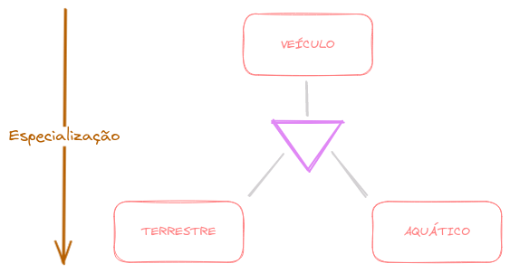
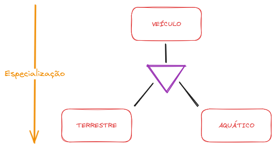

<Tip>**Exemplo** **`EMPREGADO`** pode ser **`HORISTA`** ou **`DIARÍSTA`**.</Tip>

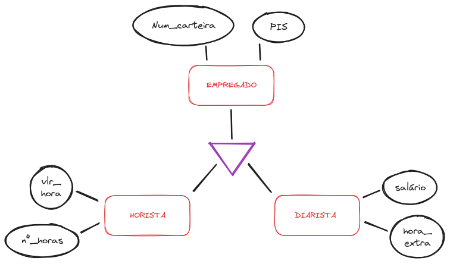
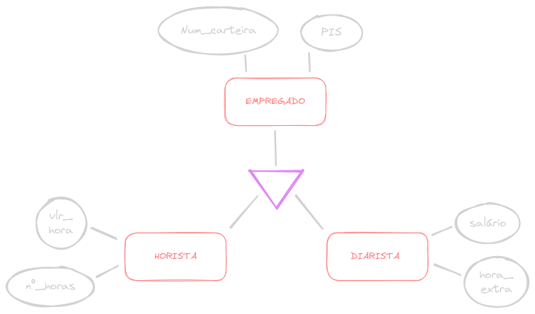

## Generalização

Usada quando entidades distintas possuem características (atributos) em comum, possibilitando a criação de uma entidade mais genêrica que as represente.

Combina conjuntos de entidades, que compartilham as mesmas características (atributos/relacionamentos), em uma entidade de mais alto nível.

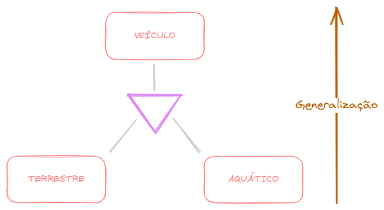
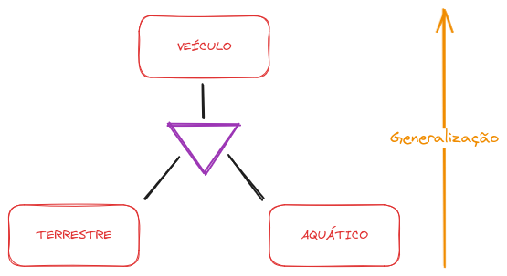

## Redundância

A generalização/especialização é muito útil para evitar **redundâncias**, por exemplo:

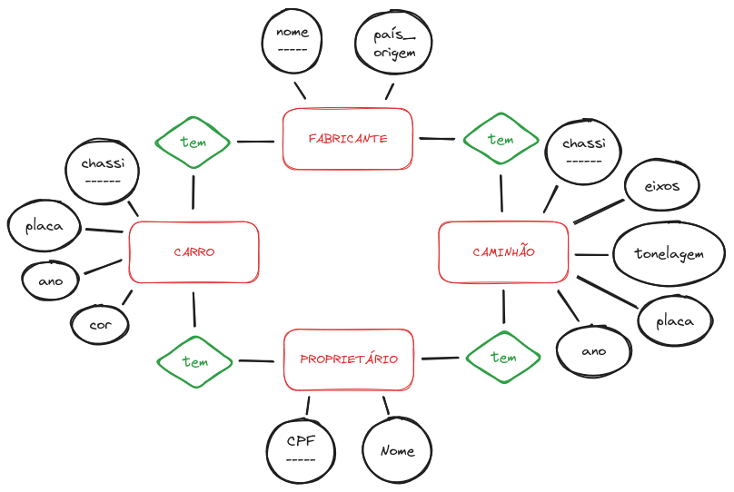
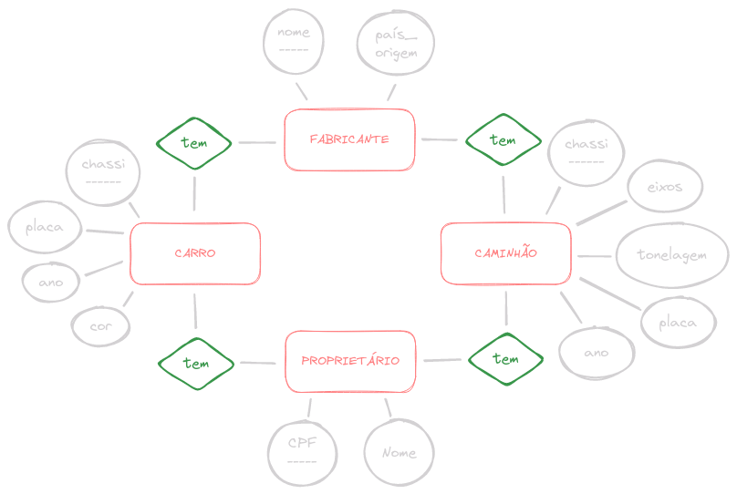

Poderíamos refazer o modelo ER da seguinte forma:

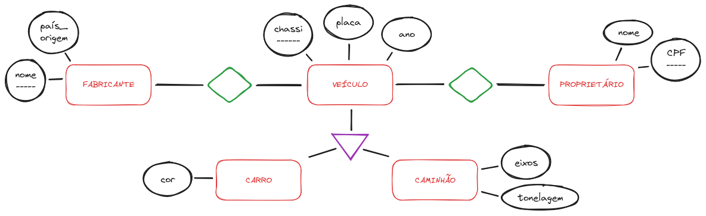
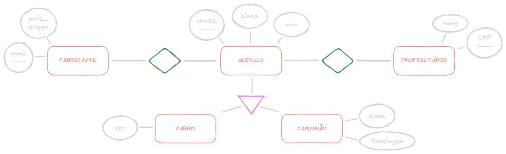

## Conselhos práticos

### ATRIBUTO vs GENEREALIZAÇÃO/ESPECIALIZAÇÃO

**Questão**: modelar um determinado objeto, por exemplo, a categoria funcional de cada empregado de uma empresa.

Como **atributo**?

- Categoria funcional como atributo da entidade **`EMPREGADO`**.

Como **generalização/especialização**?

- Cada categoria funcional corresponderá a uma especialização da entidade **`EMPREGADO`**.

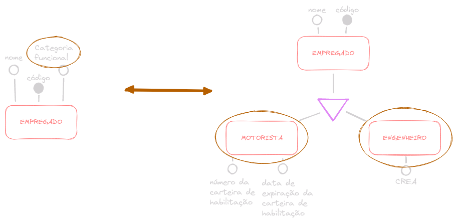
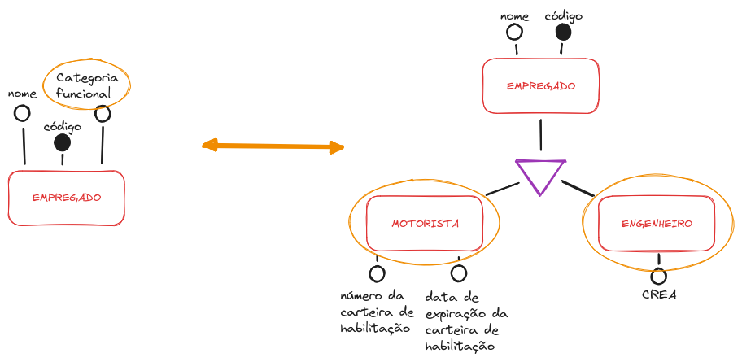

### Atributo opcional

Pode indicar subconjuntos de entidades que são modelados mais corretamente através de especializações. Exemplo:

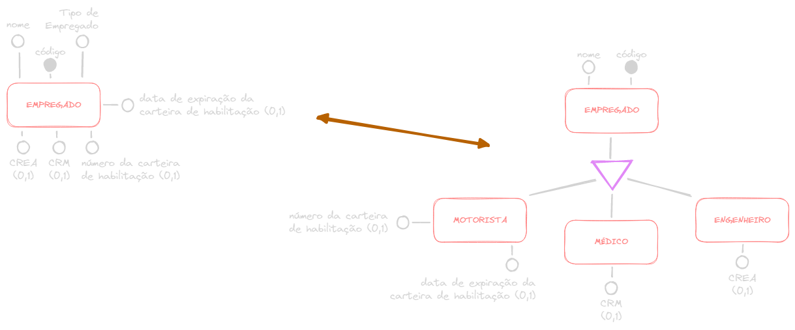
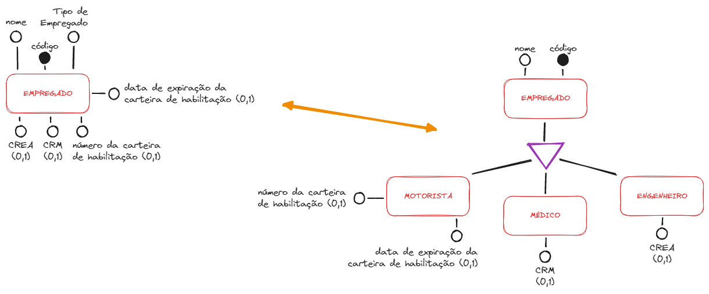

## Tipos de generalização/especialização

### Total

Nesse tipo generalização/especialização, a existência da ocorrência da entidade genérica OBRIGATORIAMENTE implica na existência da ocorrência da entidade especializada.

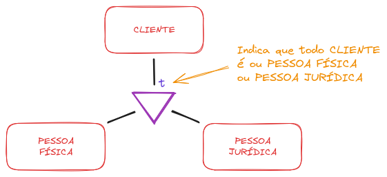
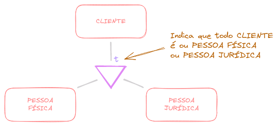

### Parcial

Nesse tipo de generalização/especialização, a existência da ocorrência da entidade genérica NÃO OBRIGA a existência da ocorrência da entidade especializada.

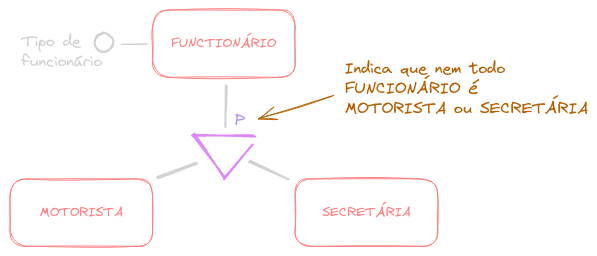
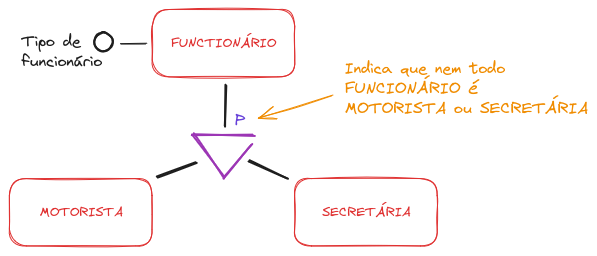

### Exclusiva

Em uma hierarquia de generalização/especialização, uma ocorrência da entidade genérica é especializada no máximo uma vez, nas folhas da árvore de generalização/especialização.

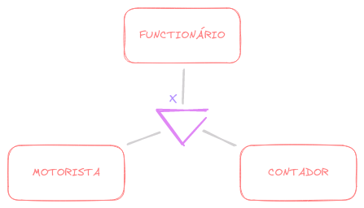
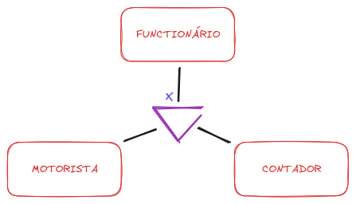

<Tip>
  O tipo exclusivo pode ser entendido como um `XOR` entre as entidades
  especializadas.
</Tip>

### Compartilhada

Em uma hierarquia de generalização/especialização, uma ocorrência da entidade genérica aparecer em várias entidades especializadas, nas folhas da árvore de generalização/especialização.

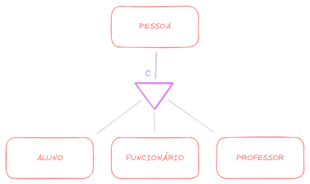
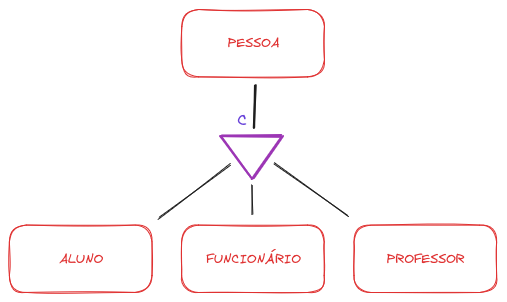

### União de tipos

| &nbsp;      | Exclusiva | Compartilhada |
| ----------- | --------- | ------------- |
| **Total**   | `tx`      | `tc`          |
| **Parcial** | `px`      | `pc`          |

**Total** + **Exclusiva** (`tx`)

> Todo cliente DEVE ser ou pessoa física, ou pessoa jurídica, mas NÃO PODE ser ambos ao mesmo tempo.

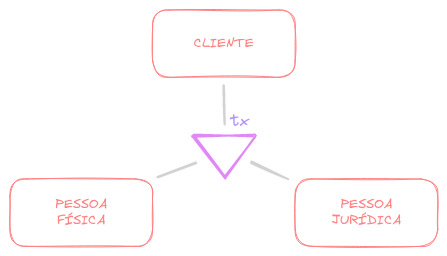
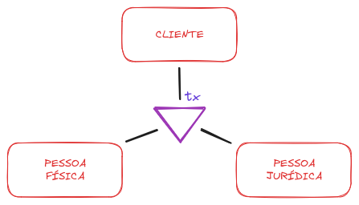

**Total** + **Compartilhada** (`tc`)

> Toda nacionalidade DEVE ser ou braileira, ou indiana, ou japonesa, ou mais de uma ao mesmo tempo.

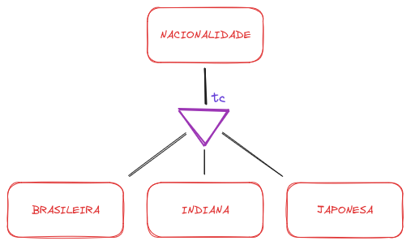
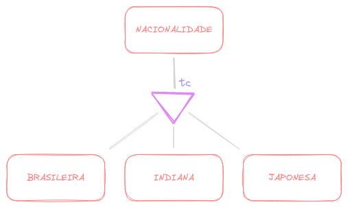

**Parcial** + **Exclusiva** (`px`)

> Todo Saiyajin PODE estar transformado OU NÂO, mas se estiver, so pode ter UMA transformação por vez.

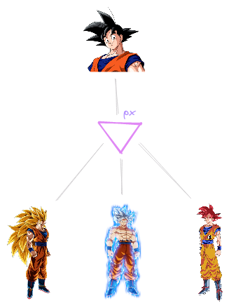
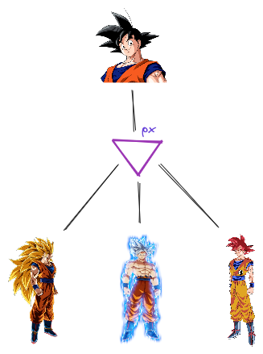

**Parcial** + **Compartilhada** (`pc`)

> Um médico PODE ser um cardiologista/neurologista OU NÃO, e se for, pode ser MAIS DE UM, ao mesmo tempo.

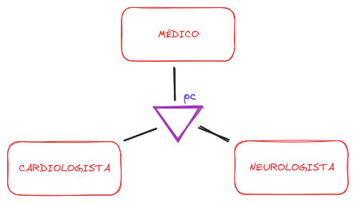
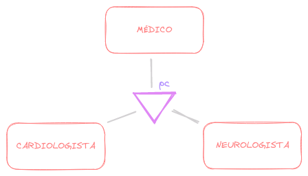

## Níveis de especialização

Não existe um limite para o nível de especialização. A árvore de especialização pode ter mais de uma camada.

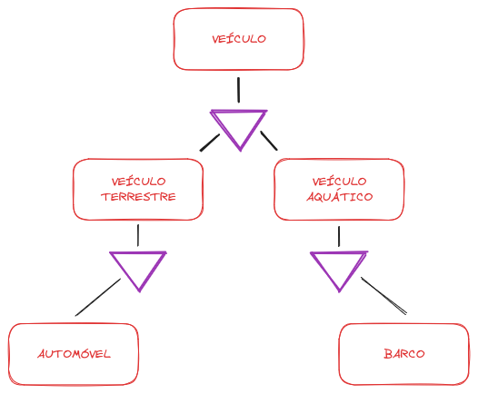
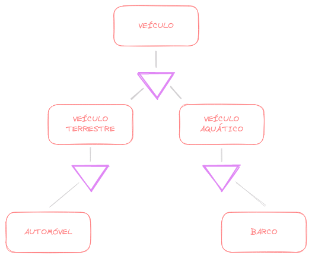

## Herança múltipla

Uma herança múltipla ocorre quando uma entidade especializada é a especializada de mais de uma entidade genérica.

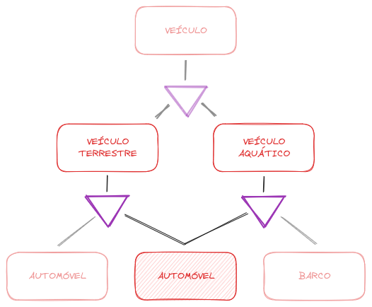
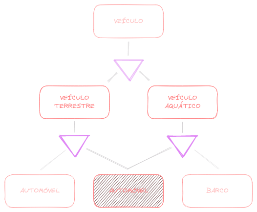

# Entidade associativa

Suponhamos a seguinte situação: Considere o relacionamento abaixo, **`MÉDICO`**-`consulta`-**`PACIENTE`**, agora precisamos armazenar informações sobre medicamentos. Para isso vamos criar a entidade **`MEDICAMENTO`**.

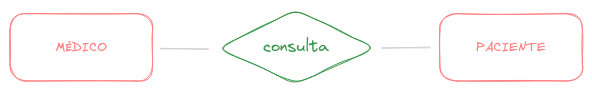

Se associarmos a entidade **`MEDICAMENTO`** à entidade **`MÉDICO`**, só saberíamos qual médico receitou o medicamento, e não para qual paciente.

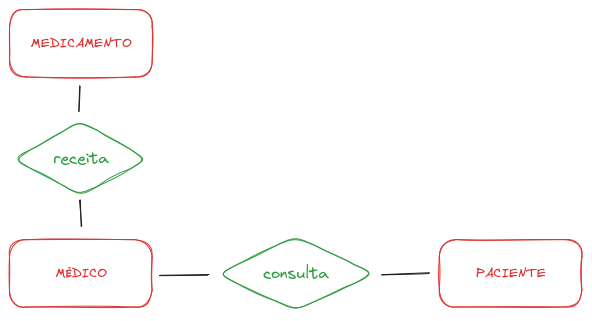
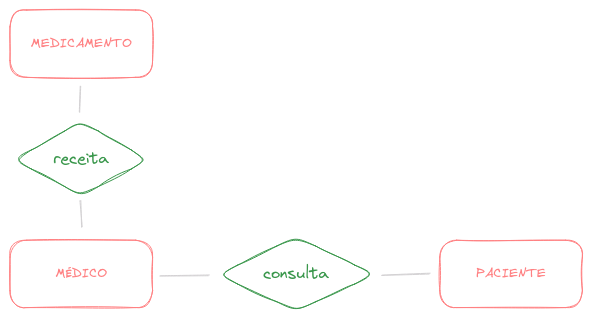

Se associarmos a entidade **`MEDICAMENTO`** à entidade **`PACIENTE`**, só saberíamos qual paciente recebeu a receita, e não quem receitou.

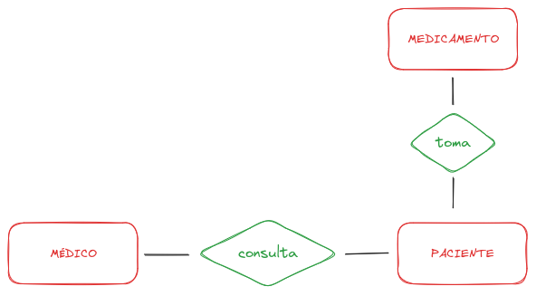
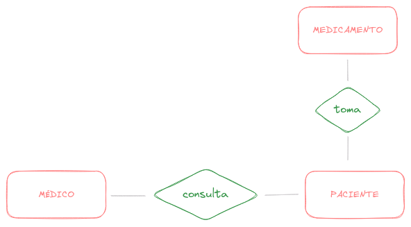

Queremos associar a entidade **`MEDICAMENTO`** à consulta. Porém, isso não está previsto no Modelo Entidade Relacionamento. Para isso foi criado o conceito de Entidade Associativa.

Esse conceito consiste em transformar um relacionamento em uma entidade para que dessa forma seja possível criar um relacionamento entre a entidade **`MEDICAMENTO`** e a entidade **`CONSULTA`**.

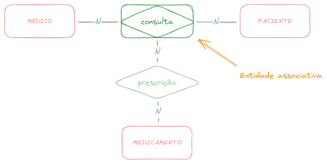
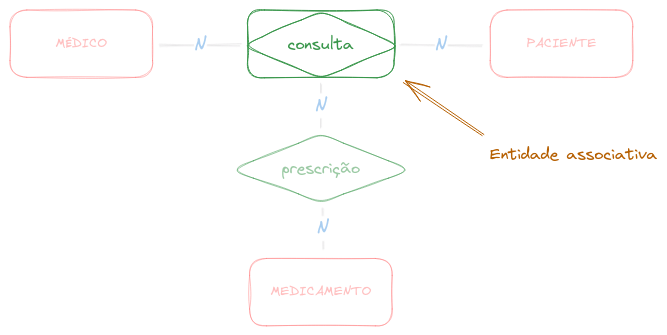
